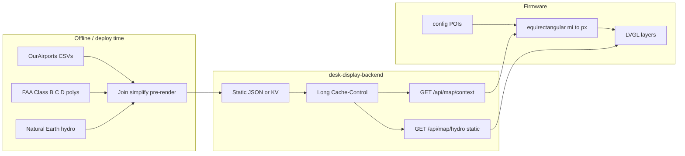

# Radar map overlays — airports, POIs, airspace, hydrography

**Date:** 2026-07-24  
**Status:** Approved for planning  
**Scope:** Geographic context layers under the live ADS-B PPI — towered airports, config POIs, Class B/C/D airspace rings, optional Deskrad-style hydrography — with a cost-light backend.

## Goals

- Give the radar **spatial awareness**: where towered airports, local POIs, and controlled airspace sit relative to traffic.
- Keep the PPI readable: static layers stay dim; **aircraft remain the hero** (green).
- Prefer **backend-prepared static data**; device only projects and draws.
- Keep the **Vercel bill flat**: no live GIS or image rasterization in the request path.

## Non-goals

- STARS / SID / STAR / preferred routes / airway networks
- Class E shelves/gradients, SUA, TFRs, altitude shelves / ceiling labels (`[40]`)
- Precipitation (separate future; may later share a static-tile path)
- ICAO keyboard recenter (already planned elsewhere)
- Editable POI UI in v1 (config / NVS only)
- Live per-request hydrography rendering on Vercel

## Product decisions (locked)

| Topic | Choice |
|-------|--------|
| Strategy | Markers → POIs → airspace → hydro (last, static only) |
| Towered | OurAirports `airports` ⨝ `airport-frequencies` where type includes **TWR** |
| Airspace | Class **B, C, and D** lateral rings only |
| Airspace style | Sectional conventions on dark PPI: B solid blue, C solid magenta, D **dashed** blue |
| POIs | Curated list in `config.h` / NVS (≤10); zero backend |
| Hydro | Precomputed static tiles/Blob only — or defer |
| Backend cost | Static/build-time data + long CDN cache; combine JSON when practical |
| STARS charts | Out |

## Architecture



- **adsb.lol** unchanged (device polls directly).
- Overlay fetch while Radar is selected; debounce **300–500 ms** after center/range change.
- Paint order: **hydro → airspace → airports/POIs → aircraft → sweep/HUD**.

## Cost rules (backend)

Vercel usage must not move meaningfully:

1. **Build-time / offline** OurAirports TWR join and airspace Douglas–Peucker simplify — not per request.
2. **Long-lived CDN/KV cache** (hours–days). Quantize geo keys (lat/lon/range buckets) so devices share hits.
3. **Few cheap GETs** — prefer one combined map-context JSON for airports + airspace.
4. **No image processing in serverless request path.** Hydro only if pre-rendered to Blob/static.
5. **Device draws** — backend returns small point/ring JSON, not rendered frames, for airports/airspace.

## Build order

1. Nearby **towered airports** (cached JSON + white markers)
2. **Config POIs** (on-device only)
3. **Class B / C / D rings** (cached JSON; D dashed)
4. **Hydrography** only as precomputed static assets (or defer)

## Visual language

### Symbology

| Element | Style | Notes |
|---------|--------|------|
| Hydrography | Very dim blue-gray (~`0x1A2A3A` family) | No labels; under all static layers |
| Class B | Solid muted blue stroke, no fill | Sectional blue, dimmed for dark PPI |
| Class C | Solid muted magenta stroke, no fill | Sectional magenta, dimmed |
| Class D | **Dashed** muted blue stroke, no fill | Same blue family as B; chart dashed convention |
| Towered airport | White star-burst / small `+` or `*` | Not green (green = aircraft) |
| POI | Dimmer white diamond or small square | Distinct from airport glyph |
| Aircraft | Existing green dots/stars | Unchanged |
| Range rings / sweep | Existing dark green | Unchanged; above map layers |

Reference: FAA sectional **AIRSPACE INFORMATION** legend (B solid blue, C solid magenta, D dashed blue). No ceiling annotations in v1.

### Interaction

| Input | Behavior |
|-------|----------|
| Tap airport / POI | Select → short label (ICAO or POI name); clears aircraft selection |
| Tap selected airport/POI / empty | Clear static selection |
| Tap aircraft | Existing aircraft select; clears static selection |
| Zoom / recenter | Overlay refetch after debounce; clear selection if target leaves viewport |

No airport/POI detail card in v1 — label only.

### Zoom & caps

| Layer | Visibility | Cap |
|-------|------------|-----|
| Hydro | 5–50 mi | One disc-sized image (~200–360 px) |
| Class B | All ranges if intersects disc | Counts toward ring budget |
| Class C | Prefer ≤35 mi; keep if space | Counts toward ring budget |
| Class D | Prefer ≤25 mi; **thin first** when over budget | Counts toward ring budget |
| Airspace total | — | **≤8 rings**; drop D first, then farthest C |
| Towered airports | All ranges | ≤20 nearest (API may return ~40) |
| POIs | All ranges | ≤10 from config |

### Failure / missing data

- Overlay fetch fail → keep last good for that center/range bucket; if none, traffic-only (today’s behavior).
- Empty airports / no B-C-D in range → fine; no placeholders.

## API contract

### Combined map context (preferred)

**`GET /api/map/context?lat=&lon=&radiusMi=`**

Returns airports + airspace in one response to minimize invocations.

```json
{
  "airports": [
    { "icao": "KDAY", "name": "James M Cox Dayton Intl", "lat": 39.9024, "lon": -84.2194 }
  ],
  "rings": [
    {
      "class": "B",
      "id": "CVG_B",
      "points": [[39.12, -84.67], [39.15, -84.50]]
    },
    {
      "class": "D",
      "id": "KDAY_D",
      "points": [[39.92, -84.25], [39.93, -84.20]]
    }
  ]
}
```

- **Airports:** OurAirports join where frequency type includes `TWR`; haversine filter; nearest first.
- **Rings:** `class` is `"B"` | `"C"` | `"D"`; `points` are `[lat, lon]` (device closes the loop if needed). Prefer ≤~60 verts/ring after offline simplify.
- **Caching:** `Cache-Control` long-lived; key by quantized lat/lon/radius.

Split endpoints (`/api/airports/nearby`, `/api/airspace`) are acceptable during bring-up if they share the same static store and cache policy; converge on the combined route before wide use.

### Hydro (phase 4 only)

**`GET /api/map/hydro?lat=&lon=&radiusMi=&size=`**

- Serves a **precomputed** static/Blob asset (or 404 if none for that bucket).
- Binary body; headers describe format (e.g. indexed palette / RGB565).
- **Must not** rasterize Natural Earth (or any GIS) inside the Vercel function on each hit.

### Existing

**`GET /api/airport?code=KXXX`** → `{ "lat", "lon" }` unchanged (recenter).

## Device model

| Concern | Approach |
|---------|----------|
| POIs | Compile-time / NVS `{name, lat, lon}` — no backend |
| Overlay poll | While Radar selected; debounce 300–500 ms after center/range change |
| Projection | Reuse `aircraftOffsetMiles` + `radar_blip_scale` |
| Airspace draw | `lv_line` loops; solid vs dashed from `class` |
| Hydro draw | `lv_img` / canvas underlay, circular clip with disc |
| Selection | Optional selected static id for label (parallel to aircraft select) |
| Caps | Enforce draw caps client-side even if API returns more |
| Cache | Last-good per quantized `(lat, lon, rangeMi)` bucket |

## Testing

- Native unit tests: parse map-context JSON; project ring verts; fixture TWR airport list.
- Sim: Dayton-area fixtures (KDAY D, nearby towered, sample hydro asset when phase 4 lands).

## Open for implementation plan (not blocking design)

- Exact CDN/KV vs static JSON file layout in `desk-display-backend`
- Quantization grid size for cache keys
- Final RGB values for muted B/C blue/magenta on the Dial
- Whether hydro ships in the first implementation plan or a follow-up

## Relationship to prior specs

- Extends future work called out in [2026-07-23-radar-live-ui-design.md](2026-07-23-radar-live-ui-design.md) (airport markers were non-goals there).
- Aligns with nearby-airport / image notes in [FIRMWARE_PLAN.md](../../FIRMWARE_PLAN.md) and [BACKEND_PLAN.md](../../BACKEND_PLAN.md), with **TWR join** and **cost-light static serving** made explicit.
