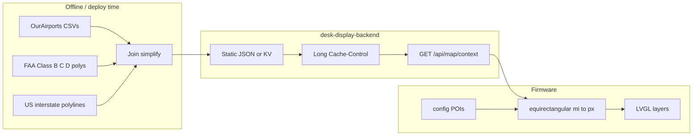

# Radar map overlays — airports, POIs, airspace, interstates

**Date:** 2026-07-24  
**Status:** Approved for planning  
**Scope:** Geographic context layers under the live ADS-B PPI — towered airports, config POIs, Class B/C/D airspace shelves, US interstate polylines — with a cost-light backend.

## Goals

- Give the radar **spatial awareness**: where towered airports, local POIs, controlled airspace, and interstates sit relative to traffic.
- Keep the PPI readable: static layers stay dim; **aircraft remain the hero** (green).
- Prefer **backend-prepared static data**; device only projects and draws.
- Keep the **Vercel bill flat**: no live GIS or image rasterization in the request path.
- Keep layers independently stored/parsed/drawn so a future settings UI can toggle highways / airspace without a backend redesign.

## Non-goals

- STARS / SID / STAR / preferred routes / airway networks
- Class E shelves/gradients, SUA, TFRs, ceiling labels (`[40]`)
- Precipitation (separate future)
- ICAO keyboard recenter (already planned elsewhere)
- Editable POI UI in v1 (config / NVS only)
- Hydrography (deferred indefinitely; interstates replace that orientation cue)
- US / state highways beyond interstates
- Settings UI / NVS layer toggles in v1 (architecture only)

## Product decisions (locked)

| Topic | Choice |
|-------|--------|
| Strategy | Highways → airspace → airports/POIs → aircraft |
| Towered | OurAirports `airports` ⨝ `airport-frequencies` where type includes **TWR** |
| Airspace | Class **B, C, and D**; **every altitude shelf** is its own lateral ring |
| Airspace style | Sectional conventions on dark PPI: B solid blue, C solid magenta, D **dashed** blue |
| POIs | Curated list in `config.h` / NVS (≤10); zero backend |
| Roads | **Interstate only** (`I-*`); dim polylines under airspace |
| Backend cost | Static/build-time data + long CDN cache; combine JSON when practical |
| STARS charts | Out |

## Architecture



- **adsb.lol** unchanged (device polls directly).
- Overlay fetch while Radar is selected; debounce **300–500 ms** after center/range change.
- Paint order: **highways → airspace → airports/POIs → aircraft → sweep/HUD**.

## Cost rules (backend)

Vercel usage must not move meaningfully:

1. **Build-time / offline** OurAirports TWR join, airspace shelf simplify, interstate simplify — not per request.
2. **Long-lived CDN/KV cache** (hours–days). Quantize geo keys (lat/lon/range buckets) so devices share hits.
3. **Few cheap GETs** — one combined map-context JSON for airports + airspace + highways.
4. **No GIS processing in the serverless request path** — only filter/clip prebuilt JSON.
5. **Device draws** — backend returns small point/ring/polyline JSON, not rendered frames.

## Build order

1. Nearby **towered airports** (cached JSON + white markers + dim ICAO labels)
2. **Config POIs** (on-device only)
3. **Class B / C / D shelves** (cached JSON; every shelf footprint; D dashed)
4. **Interstate polylines** (cached JSON; dim gray under airspace)

## Visual language

### Symbology

| Element | Style | Notes |
|---------|--------|------|
| Interstates | Very dim gray (~`0x2A323C`), 1px | No labels; under airspace |
| Class B | Solid muted blue stroke, no fill | Sectional blue, dimmed for dark PPI |
| Class C | Solid muted magenta stroke, no fill | Sectional magenta, dimmed |
| Class D | **Dashed** muted blue stroke, no fill | Same blue family as B; chart dashed convention |
| Towered airport | White `+` + dim ICAO label | Not green (green = aircraft) |
| POI | Dimmer white small square | Distinct from airport glyph; label on select |
| Aircraft | Existing green dots/stars | Unchanged |
| Range rings / sweep | Existing dark green | Unchanged; above map layers |

Reference: FAA sectional **AIRSPACE INFORMATION** legend (B solid blue, C solid magenta, D dashed blue). No ceiling annotations in v1.

### Interaction

| Input | Behavior |
|-------|----------|
| Tap airport / POI | Select → short label (ICAO or POI name); clears aircraft selection |
| Tap selected airport/POI / empty | Clear static selection |
| Tap aircraft | Existing aircraft select; clears static selection |
| Zoom / recenter | Overlay refetch after debounce; clear selection if target leaves viewport |

No airport/POI detail card in v1 — label only. Highways are not tappable.

### Zoom & caps

| Layer | Visibility | Cap |
|-------|------------|-----|
| Interstates | All ranges if intersects disc | ≤12 routes; ≤80 verts/route after clip |
| Class B/C/D shelves | All ranges if intersects disc | Counts toward ring budget |
| Airspace total (parse) | — | **≤24 rings** |
| Airspace total (view) | — | **≤16 rings**; drop D first, then farthest |
| Towered airports | All ranges | ≤20 nearest (API may return ~40) |
| POIs | All ranges | ≤10 from config |

### Failure / missing data

- Overlay fetch fail → keep last good for that center/range bucket; if none, traffic-only (today’s behavior).
- Empty airports / no B-C-D / no interstates in range → fine; no placeholders.

### Future settings (not v1)

Device-side NVS/config flags can skip drawing highways and/or airspace (and later per-class B/C/D) while still using the same map-context payload. Optional query-param layer masks can shrink payloads later.

## API contract

### Combined map context

**`GET /api/map/context?lat=&lon=&radiusMi=`**

Returns airports + airspace + highways in one response.

```json
{
  "airports": [
    { "icao": "KDAY", "name": "James M Cox Dayton Intl", "lat": 39.9024, "lon": -84.2194 }
  ],
  "rings": [
    {
      "class": "B",
      "id": "CVG_B_0",
      "points": [[39.12, -84.67], [39.15, -84.50]]
    },
    {
      "class": "D",
      "id": "KDAY_D_0",
      "points": [[39.92, -84.25], [39.93, -84.20]]
    }
  ],
  "highways": [
    { "id": "I-75", "route": "I-75", "points": [[39.95, -84.19], [39.80, -84.20]] }
  ]
}
```

- **Airports:** OurAirports join where frequency type includes `TWR`; haversine filter; nearest first.
- **Rings:** `class` is `"B"` | `"C"` | `"D"`; **one entry per shelf footprint**; `points` are `[lat, lon]`. Prefer ≤~60 verts/ring after offline simplify. IDs include shelf index.
- **Highways:** interstate-only polylines; `points` are `[lat, lon]`.
- **Caching:** `Cache-Control` long-lived; key by quantized lat/lon/radius.

### Existing

**`GET /api/airport?code=KXXX`** → `{ "lat", "lon" }` unchanged (recenter).

## Device model

| Concern | Approach |
|---------|----------|
| POIs | Compile-time / NVS `{name, lat, lon}` — no backend |
| Overlay poll | While Radar selected; debounce 300–500 ms after center/range change |
| Projection | Reuse `aircraftOffsetMiles` + `radar_blip_scale` |
| Highway draw | Separate `lv_line` polylines under airspace (toggleable later) |
| Airspace draw | Separate `lv_line` loops; solid vs dashed from `class` |
| Selection | Optional selected static id for label (parallel to aircraft select) |
| Caps | Enforce draw caps client-side even if API returns more |
| Cache | Last-good per quantized `(lat, lon, rangeMi)` bucket |

## Testing

- Native unit tests: parse map-context JSON (rings + highways); project ring verts; fixture TWR airport list.
- Backend tests: MultiPolygon → multiple shelf rings; highway radius filter.
- Sim: Dayton-area fixtures (KDAY D shelves, nearby towered, short I-75 stub).

## Relationship to prior specs

- Extends future work called out in [2026-07-23-radar-live-ui-design.md](2026-07-23-radar-live-ui-design.md) (airport markers were non-goals there).
- Aligns with nearby-airport / image notes in [FIRMWARE_PLAN.md](../../FIRMWARE_PLAN.md) and [BACKEND_PLAN.md](../../BACKEND_PLAN.md), with **TWR join** and **cost-light static serving** made explicit.
