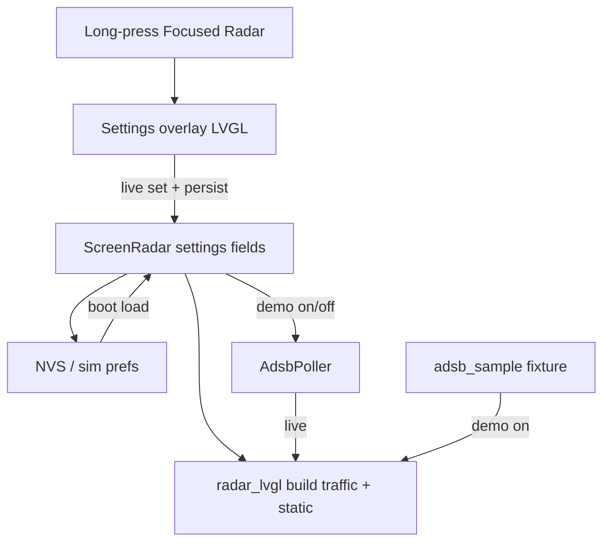

# Radar settings — declutter, map clutter, demo mode

**Date:** 2026-07-25  
**Status:** Approved for planning  
**Scope:** Focused-radar settings overlay (long-press), persistent declutter / map-layer / demo preferences, and a reserved full-tag line 4 for future arrival airport.

## Goals

- Let the operator control **how much traffic labeling** appears (declutter) without losing the ability to inspect any target.
- Let the operator toggle **map overlays** (airports, airspace, roads) independently.
- Provide a **demo mode** that shows fixture traffic instead of live ADS-B.
- **Persist** those choices across reboot (NVS on device; prefs file in sim).
- Keep settings **scoped to Radar** via a full-screen overlay opened by long-press.

## Non-goals

- ICAO airport keyboard / temp recenter / pin-center UI (pin long-press is replaced by settings this pass; recenter may return later inside settings)
- Fetching arrival/destination airports (routeset workstream later); line 4 is layout-only until then
- Backend preferences API or multi-device sync
- Global carousel Settings screen (Wi-Fi, brightness, etc.)
- Changing map-context API shape; “Roads” gates existing interstate polylines client-side
- Per–airspace-class toggles (B/C/D as one Airspace switch)

## Product decisions (locked)

| Topic | Choice |
|-------|--------|
| Entry | Long-press on focused Radar opens settings (replaces `pinCenter()` for this pass) |
| UI | Full-screen overlay over PPI; sectioned page (title + Done; chip rows) |
| Apply | Live — each change updates radar immediately and persists |
| Exit | Done control or center-tap closes overlay; center-tap does **not** leave Focused while settings open |
| Zoom while open | **Frozen** (rotate ignored) |
| Declutter default | `TargetTag` (today’s dense → full on select) |
| Map clutter default | Airports + Airspace + Roads all **on** |
| Demo default | **Off** |
| Idle settle | Keeps settings; clears aircraft selection only (unchanged) |
| Selection | In **every** declutter mode, tapping a target (or its visible label) shows the **full tag** |
| Arrival line | Full tag reserves line 4; omit when no arrival data (always omit this pass) |

## Declutter modes

| Mode | Unselected traffic (≤ vector range, as today) | Selected |
|------|-----------------------------------------------|----------|
| `TargetOnly` | Symbol / blip only — no callsign, no dense tag | Full tag |
| `TargetCallsign` | Symbol + callsign line | Full tag |
| `TargetTag` | Symbol + dense tag (callsign + dense alt/speed) — **current behavior** | Full tag |

Notes:

- Outside the existing ≤25 mi vector/tag range, unselected traffic remains dots-only regardless of declutter (zoom honesty unchanged). Selected full tag still applies when a blip is selected.
- Notable/emergency coloring of the symbol is unchanged.
- Factory / first-boot default: `TargetTag`.

## Map clutter

Independent booleans:

- `showAirports` — towered airport marks + labels (and curated POIs follow the same gate)
- `showAirspace` — Class B/C/D rings
- `showRoads` — interstate highway polylines

Gate in the device draw/reproject path so one map-context payload still works. Empty or missing highway data simply draws nothing when roads are on.

## Demo mode

| State | Behavior |
|-------|----------|
| Off | Live `AdsbPoller` → adsb.lol (current path) |
| On | Bind `fixtures/adsb_sample.json` (or equivalent embedded fixture); **skip** live ADS-B poll |

Map overlays continue to use the existing map-context poll / boot fixture path (not replaced by demo). Show a clear **Demo** indicator in the radar header or HUD so the operator knows traffic is not live.

## Settings UI (layout A)

```
┌─────────────────────────────────────┐
│ Radar Settings              [Done]  │
├─────────────────────────────────────┤
│ DECLUTTER                           │
│ [ Target ] [ Callsign ] [ Tag ]     │  ← exclusive
│                                     │
│ MAP CLUTTER                         │
│ [ Airports ] [ Airspace ] [ Roads ] │  ← multi-select
│                                     │
│ Demo Mode                     Off   │  ← toggle
└─────────────────────────────────────┘
```

- Chip labels may shorten for width (`Target` / `Callsign` / `Tag`); meaning matches the modes above.
- Map chips show selected vs unselected visually; any combination allowed (including all off).

## Persistence

**Keys** (logical; exact NVS encoding left to plan):

| Key | Type | Factory default |
|-----|------|-----------------|
| `declutter` | enum `TargetOnly` \| `TargetCallsign` \| `TargetTag` | `TargetTag` |
| `showAirports` | bool | true |
| `showAirspace` | bool | true |
| `showRoads` | bool | true |
| `demoMode` | bool | false |

- **Device:** ESP32 NVS namespace `radar`.
- **Sim:** Small local prefs file with the same keys (path chosen in plan; gitignored if under working dir).
- Load once at radar/settings init; write on each successful change.
- Corrupt or missing values → factory defaults for that key (or all keys if the blob is unreadable).

## Architecture



- Domain (`ScreenRadar` / format helpers) owns mode semantics and layer flags.
- LVGL owns overlay chrome and chip hit-testing.
- Poller / `SimApp` owns demo data-source switch.

## Full tag line 4 (arrival — stub)

Selected full tag layout:

```
CALLSIGN
A045 ^ G280
B738 1200 MIL
KORD            ← line 4 when arrival ICAO present
```

This pass: add the formatting/layout hook; **never invent** an airport. No parser field, no routeset call.

**Future workstream (not this plan):** backend or device lookup via adsb.lol `/api/0/routeset` (callsign → origin/destination), cache by callsign, populate `Aircraft` arrival ICAO when known. Commercial flights often resolve; GA/military/charter often do not.

## Gesture matrix (Focused Radar)

| Input | Settings closed | Settings open |
|-------|-----------------|---------------|
| Long-press | Open settings | No-op |
| Center-tap | `revertTempCenter()` then Nav → Carousel (unchanged) | Close settings only |
| Rotate | Zoom ±5 mi | Ignored (frozen) |
| Tap | Hit-test blip / static / clear | Chip / Done only |
| Double-tap | Clear selections | No-op or ignored |

Idle settle while settings are open: **close the overlay**, clear aircraft selection, **keep** persisted prefs. Intentional settings are the values, not the overlay chrome.

## Testing

- Domain: declutter mode → which tag lines are requested for selected vs unselected.
- Domain: layer flags gate overlay lists / draw eligibility.
- Prefs: round-trip enum + bools; corrupt → defaults.
- Demo: on binds fixture and does not require network; off resumes poll path (sim-level test acceptable).
- LVGL/sim smoke: long-press opens overlay; Done/center closes; zoom frozen while open.

## Open follow-ups (explicitly deferred)

1. Arrival airport via routeset (line 4 data).
2. Airport recenter / pin controls inside settings.
3. Global Settings carousel screen absorbing radar prefs.
4. Optional `?layers=` on map-context to shrink payloads.
