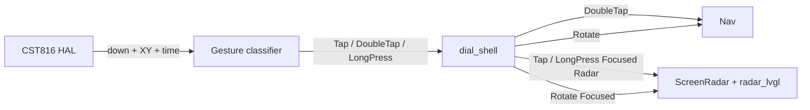

# Dial gesture remap (double-tap focus, tap select)

**Date:** 2026-08-04  
**Status:** Approved for planning  
**Hardware:** Waveshare ESP32-S3-Knob-Touch-LCD-1.8 (“Dial”)  
**Env:** PlatformIO `dial`

## Goal

Remap Dial touch so **double-tap** is the Carousel ↔ Focused “knob click,” **single tap** is available for in-app select (Radar hit-test), and **long-press** opens Radar settings. Encoder zoom on Focused Radar stays as today.

## Non-goals

- Web app / browser radar client (leave untouched)
- Sim / SDL shell updates (`src/sim/**` is deprecated for this work; leave alone)
- Radar ClassicSweep ↔ Detail mode toggle on Dial
- Center-circle gating (gestures remain full-face)
- LVGL pointer / encoder `indev` drivers
- Changing carousel chrome, idle timeouts, or screen set

## Context

The rotary ring has **no push button**. Today Dial maps any short CST816 press → `Nav::on_center_tap()` (Carousel ↔ Focused). That leaves no gesture for blip select or settings without stealing the only exit.

Device development is the source of truth; sim parity is not required. Shared `lib/desk_display` domain + `radar_lvgl` hit-test stay reusable; only Dial HAL/shell wiring and Nav docs for Dial change.

## Decisions

| Topic | Choice |
|--------|--------|
| Focus enter/exit | **Double-tap** anywhere → `Nav` Carousel ↔ Focused |
| Carousel single tap | **Ignore** (preview stays non-interactive) |
| Focused single tap | Screen-owned; Radar → existing `radar_lvgl_hit_blip` / `hit_static` select/clear |
| Focused long-press | Radar → open settings; other screens ignore for this pass |
| Settings open | Chip taps apply; Done or **double-tap** closes settings only (stay Focused); rotate frozen |
| Encoder | Unchanged: Carousel highlight / Focused Radar range |
| Select declutter gate | **None** — single-tap select in all declutter modes |
| Detail mode | Not on Dial this pass |
| Sim / web | Out of scope |

## Gesture matrix (Dial)

| Gesture | Carousel | Focused (Radar) | Focused (other) | Radar settings open |
|---------|----------|-----------------|-----------------|---------------------|
| Rotate | Cycle highlight | Zoom range | Existing screen rotate | Frozen / ignored |
| Single tap | Ignore | Hit-test select / clear | Ignore (Sports/Weather/TZ focus taps not in this pass) | Settings chip hit-test |
| Double tap | Enter Focused on highlight | Exit → Carousel (`revertTempCenter` as today) | Exit → Carousel | Close settings only |
| Long press | Ignore | Open settings | Ignore | Ignore |

## Architecture

| Piece | Responsibility |
|--------|----------------|
| Pure gesture helper in `lib/desk_display` | Timing: tap vs double-tap vs long-press from contact samples + optional XY |
| `src/hal/touch.*` | Read CST816 presence + XY; feed classifier; expose poll API |
| `src/hal/dial_shell.*` / `main.cpp` | Route DoubleTap → Nav; Tap/LongPress → Focused Radar; stop treating short press as CenterTap |
| `radar_lvgl` hit helpers | Reuse as-is for select + settings hits |
| `docs/NAV.md` | Document Dial double-tap as knob-click substitute |

`Nav::on_center_tap()` may remain for native tests / API stability; Dial invokes that path from **DoubleTap** (or a one-line alias). Do not require web or sim call sites to change.

### Touch classifier

- Short down→up: arm a single-tap; if a second tap arrives within the double window, emit **DoubleTap** and cancel the pending single.
- Hold past long-press threshold (while still down): emit **LongPress** once; suppress the following up as a tap.
- After any fire: short refractory to debounce bounce.
- Coordinates: LVGL/display space after the 180° MADCTL desk mount (touch HAL owns any CST816 → display remap).

Timing defaults for the plan (tunable on device): single-tap max hold 400 ms (reuse `kCenterTapMaxMs`); double-tap gap 350 ms; long-press 600 ms; refractory 80 ms.

## Radar Focused behavior

- Tap nearest aircraft blip within existing hit radius → select or clear if already selected.
- Else tap nearest static mark → select/clear static.
- Else clear both selections.
- Long-press → `openSettings()`. On settings chip change: `saveRadarSettingsNvs` (API already in `radar_prefs.hpp`). Boot: `loadRadarSettingsNvs` into `ScreenRadar`. Demo on → bind fixture and skip live ADS-B (same domain rules as settings design).
- On Focused → Carousel via double-tap: call `revertTempCenter()` then Nav toggle (same as former center-tap exit).

## Out of scope fence

| In | Out |
|----|-----|
| Dial firmware touch + shell | Web app repo / client |
| Radar settings overlay + NVS load/save on Dial | `src/sim/**` edits |
| Native tests for gesture timing | Classic ↔ Detail on Dial |
| Docs for Dial Nav mapping | Focused Sports/Weather/TZ tap actions |

## Testing

- Native: gesture classifier unit tests (single, double, long, refractory, no false double from long).
- On device: Carousel double-tap enters highlight; Focused double-tap returns; Radar tap selects blip; long-press opens settings; double-tap closes settings without leaving Focused; encoder zoom unchanged; carousel single tap does nothing.

## Risks

| Risk | Mitigation |
|------|------------|
| Double-tap latency before single-tap select fires | Keep double window tight; accept ~300 ms select delay |
| XY wrong after 180° panel rotate | Verify mapping once on device; fix in touch HAL only |
| Accidental double-tap while selecting | Refractory + hit-test only on confirmed single Tap |
| Settings unreachable discovery | Long-press is the only entry; no on-screen affordance this pass (same as sim) |
